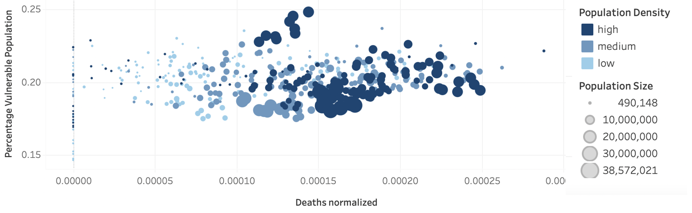
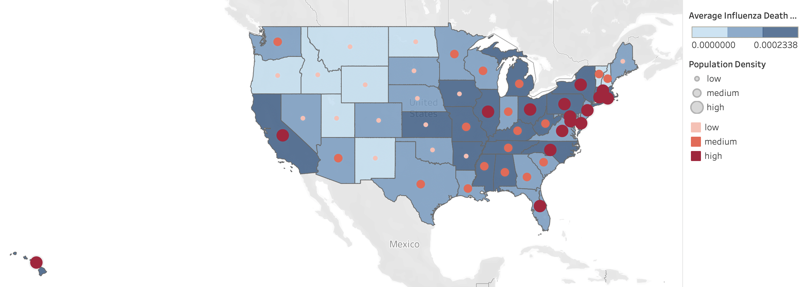
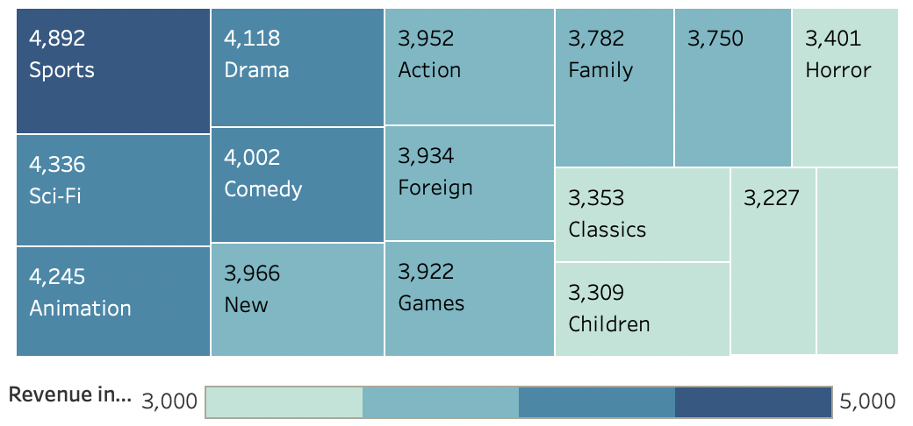
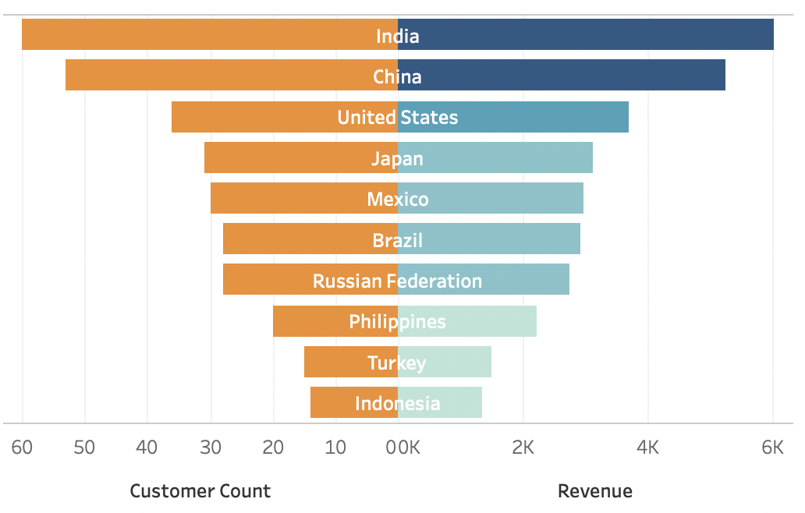
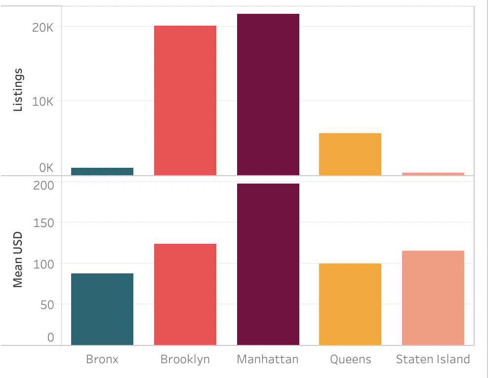
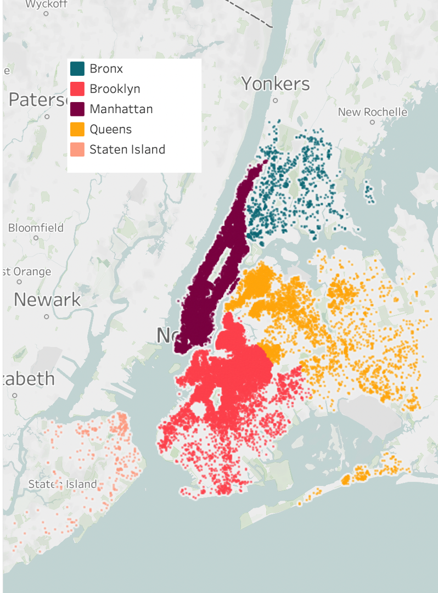
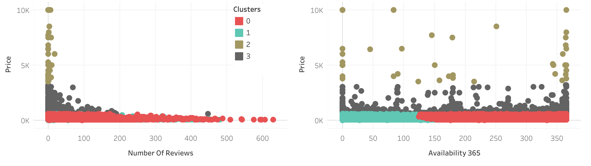

## Portfolio

---

### [Case Study: Instacart Grocery Basket Analysis](https://github.com/nora-marie-95/Instacart-Basket-Analysis-Project)

Background: Instacart is an existing online grocery store that operates through an app. For this project, I analyzed purchasing behaviours and customer profiles.

Data: Open-sourced from Instacart. The final integrated data set has over 30 million rows and includes information about orders, Instacart's customers and products. [The dataset can be downloaded here.](https://www.instacart.com/datasets/grocery-shopping-2017)

Tools: Python and Jupyter, Libraries: Pandas, Numpy, Matplotlib, Seaborn, Scipy

Procedures: Data wrangling, combining data, deriving new variables, grouping data and aggregating variables

Findings: The weekday where the most orders are placed is Saturday. The time period with the highest number of purchases is between 10 a.m. and 1 p.m.    

  <figure>
    
    <figcaption>Figure 1. Cumulative orders per weekday.</figcaption>
  </figure>
  <figure>
    
    <figcaption>Figure 2. Cumulative orders per time period.</figcaption>
  </figure>

   
The most expensive products are purchased at 2 a.m. The departments with the most product orders are the produce, dairy eggs, snacks and beaverages department!   

  <figure>
    
    <figcaption>Figure 3. Mean price in dollars per hour of the day.</figcaption>
  </figure>
  <figure>
    
    <figcaption>Figure 2. Cumulative orders per department.</figcaption>
  </figure>

  
Conclusions and Recommendations: The busiest day of the week is Saturday and the busiest time of the day is 10am – 13pm. Instacart needs to have enough staff available at these times. Instacart should schedule ads between 22pm and 9am when there are fewer orders. People buy the most expensive products at 2am. Instacart should recommend more expensive products at that time. 

---
### [Case Study: Preparing for Influenza Season](https://public.tableau.com/app/profile/nora.lienenbecker/viz/PreparingforInfluenzaSeason_16260986850200/PreparingforInfluenzaSeason2)

Background: The United States has an influenza season where more people than usual suffer from the flu. Some people, particularly those in vulnerable populations, develop serious complications and end up in the hospital. Hospitals and clinics need additional staff to adequately treat these extra patients. The medical staffing agency provides this temporary staff. ​Determine when to send staff, and how many, to each state. 

Data: Influenza deaths by geography, time, age, gender from the CDC, [click here to download data set.](https://coach-courses-us.s3.amazonaws.com/public/courses/da_program/CDC_Influenza_Deaths_edited.xlsx) Population data by geography from the US Census Bureau, [click here to download data set.](https://coach-courses-us.s3.amazonaws.com/public/courses/data-immersion/A1-A2_Influenza_Project/Census_Population_transformed_202101.csv) 

Tools: Excel, Tableau

Procedueres: Data cleaning, data integration and transformation, statistical hypothesis testing, visual analysis and storytelling with Tableau 

Findings: States with a high population density are more likely to have a higher number of influenza deaths relative to their population size. 

Figure 5. Relationship Between Population Size, Population Density, Percentage of Vulnerable Population and Influenza Death Rates in the US (2009-2017).

There is a positive correlation between the population size of a state and influenza death rates. 

Figure 6. Influenza Death Rates and Population Density Across US States (2009-2017).   
     
Conclusions and Recommendations: There is a strong correlation between population density and influenza death rates. A weak correlation was found between the size of the vulnerable population and influenza deaths in a state. Therefore, the staffing plan should prioritize states with a high population density and those with a large vulnerable population. Influenza season lasts from December to March. In January influenza deaths peak so this is when most recourses will be needed.

---
### [Case Study: Rockbuster Stealth Analysis](https://public.tableau.com/app/profile/nora.lienenbecker/viz/RockbusterDataAnalysis_16299034663000/RockbbusterDataAnalysis)

Background: Rockbuster Stealth LLC is a movie rental company that used to have stores around the world. Facing stiff competition from streaming services such as Netflix and Amazon Prime, the Rockbuster Stealth management team is planning to use its existing movie licenses to launch an online video rental service in order to stay competitive.

Data: The data set is a relational data base which contains information about Rockbuster’s film inventory, customers, and payments. [Click here to downlowad data set.](http://www.postgresqltutorial.com/wp-content/uploads/2019/05/dvdrental.zip)

Tools: SQL, DB Visualizer, Tableau

Procedures: Summarizing and cleaning data, filtering data, joining tables, subqueries and CTEs

Findings: 
The genres that bring in the highest revenue are Sports, Sci-Fi and Animation.

Figure 7. Total Revenue in dollar by movie genre.  
 
India has the highest customer count and revenue, followed by China and the US.

Figure 8. Sales and Customer Counts of Top 10 Countries. 

Conclusions and Recommendations: The top 3 countries in terms of revenue and customer numbers are India, China and the US. Sports, Sci-Fi and Animation movies contribute the most to Rockbuster’s revenue. Rockbuster should focus on their top markets and promote their most popular genres

---
### [Case Study: Airbnb NYC Analysis](https://public.tableau.com/app/profile/nora.lienenbecker/viz/AirbnbListingsAnalysis/Story1)

Background: Since 2008, guests and hosts have used Airbnb to expand on traveling possibilities and present more unique, personalized way of experiencing the world. In this case study, I used a number of analytical approaches to develop insights into what drives the prices of Airbnb listings in New York City. 

Data: Open-source data from Kaggle. Describes the listing activity and metrics in NYC, NY for 2019.
The original data set has 48895 rows and 16 columns. [The data can be downloaded here](https://www.kaggle.com/datasets/dgomonov/new-york-city-airbnb-open-data)

Tools: Python and Jupyter, Tableau 

Procedures: Data cleaning and wrangling, exploratory analysis, machine learning techniques: regression analysis and clustering, geospatial analysis, analysing time series data 

Findings: 

Manhattan has the highest number of listings and the most expensive prices. The Bronx has the lowest number of listings and the lowest prices. 

Figure 9. Number of Listings and Mean Price per Borough. 

Figure 10. Airbnb Listings per Borough.

Figure 11. Cluster analysis.

Conclusions and Next Steps: I was able to identify four clusters in the data. The four types of Airbnbs are luxury (cluster 2), expensive (cluster 3), affordable with a high availability (0) and affordable with a low availability (1). Luxury and expensive apartments have a low number of reviews compared to affordable apartments. Hosts of luxury apartments have few listings. A next step could be to use a classification algorithm to see whether prices can be predicted based on the identified clusters.

---

Page template forked from <a href="https://github.com/evanca/quick-portfolio">evanca</a>

<!-- Remove above link if you don't want to attibute -->
